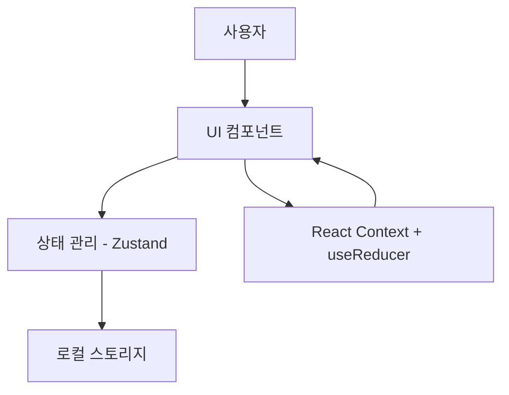
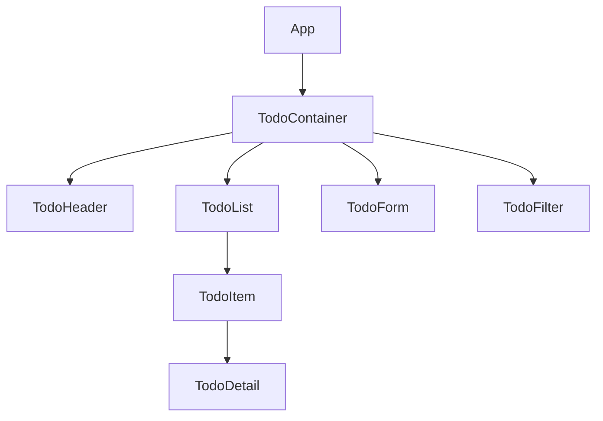

# Todo 앱 설계 문서

## 1. 아키텍처 개요

Todo 앱은 React를 기반으로 한 프론트엔드 애플리케이션으로, 클라이언트 측에서 모든 기능을 처리합니다. 데이터는 Zustand를 통해 관리되며, UI는 Bootstrap을 활용하여 구현합니다. 추후 백엔드 연동을 고려한 확장 가능한 구조로 설계됩니다.



## 2. 컴포넌트 구조

### 2.1 컴포넌트 계층도



### 2.2 주요 컴포넌트 설명

#### App
- 최상위 컴포넌트
- 전체 앱 레이아웃 관리
- 라우팅 설정 (필요시)

#### TodoContainer
- Todo 앱의 메인 컨테이너
- 하위 컴포넌트 통합 관리

#### TodoHeader
- 앱 제목 및 요약 정보 표시
- 새 Todo 추가 버튼

#### TodoList
- Todo 항목 목록 표시
- TodoItem 컴포넌트 렌더링

#### TodoItem
- 개별 Todo 항목 표시
- 완료 체크박스, 수정/삭제 버튼
- 상세 정보 토글

#### TodoForm
- Todo 항목 생성 및 수정 폼
- 입력 필드 및 제출 버튼

#### TodoFilter
- 필터링 및 정렬 옵션 제공
- 검색 기능

#### TodoDetail
- Todo 항목의 상세 정보 표시
- 모달 또는 확장 패널 형태

## 3. 데이터 모델

### 3.1 Todo 항목 모델

```typescript
interface Todo {
  id: string;           // 고유 식별자
  title: string;        // 제목 (필수)
  description?: string; // 설명 (선택)
  priority: 'low' | 'medium' | 'high'; // 우선순위
  dueDate?: Date;       // 마감일 (선택)
  completed: boolean;   // 완료 여부
  createdAt: Date;      // 생성일
}
```

## 4. 상태 관리

### 4.1 Zustand 스토어 설계

```typescript
interface TodoState {
  todos: Todo[];
  
  // 액션
  addTodo: (todo: Omit<Todo, 'id' | 'createdAt'>) => void;
  updateTodo: (id: string, updates: Partial<Todo>) => void;
  deleteTodo: (id: string) => void;
  toggleComplete: (id: string) => void;
  
  // 필터링
  filter: {
    status: 'all' | 'active' | 'completed';
    priority: 'all' | 'low' | 'medium' | 'high';
    searchQuery: string;
  };
  setFilter: (filter: Partial<TodoState['filter']>) => void;
}
```

### 4.2 Context + useReducer 설계

```typescript
// 액션 타입
type TodoAction = 
  | { type: 'ADD_TODO'; payload: Todo }
  | { type: 'UPDATE_TODO'; payload: { id: string; updates: Partial<Todo> } }
  | { type: 'DELETE_TODO'; payload: string }
  | { type: 'TOGGLE_COMPLETE'; payload: string }
  | { type: 'SET_FILTER'; payload: Partial<TodoState['filter']> };

// 리듀서 함수
const todoReducer = (state: TodoState, action: TodoAction): TodoState => {
  switch (action.type) {
    case 'ADD_TODO':
      // 구현
    case 'UPDATE_TODO':
      // 구현
    // 기타 케이스
    default:
      return state;
  }
};
```

## 5. 사용자 인터페이스 설계

### 5.1 화면 레이아웃

```
+----------------------------------+
|           TodoHeader             |
+----------------------------------+
|  TodoFilter                      |
+----------------------------------+
|                                  |
|  TodoList                        |
|    - TodoItem 1                  |
|    - TodoItem 2                  |
|    - ...                         |
|                                  |
+----------------------------------+
|           TodoForm               |
+----------------------------------+
```

### 5.2 반응형 디자인 고려사항

- 모바일 화면에서는 TodoForm이 하단에 고정
- 데스크톱에서는 2열 레이아웃 가능 (목록 + 상세/폼)
- Bootstrap의 그리드 시스템 활용

## 6. 데이터 흐름

### 6.1 기본 데이터 흐름

1. 사용자가 UI를 통해 액션 수행 (Todo 추가, 수정 등)
2. 컴포넌트에서 Zustand 액션 호출
3. Zustand가 상태 업데이트 및 로컬 스토리지 저장
4. 상태 변경에 따라 UI 자동 업데이트

```mermaid
sequenceDiagram
    참가자 User
    참가자 Component
    참가자 Zustand
    참가자 LocalStorage
    
    User->>Component: 액션 수행
    Component->>Zustand: 액션 호출
    Zustand->>Zustand: 상태 업데이트
    Zustand->>LocalStorage: 데이터 저장
    Zustand->>Component: 상태 변경 알림
    Component->>User: UI 업데이트
```

## 7. 확장성 고려사항

### 7.1 백엔드 연동 준비

- API 서비스 레이어 분리
- 데이터 페칭 로직을 커스텀 훅으로 캡슐화
- Zustand 미들웨어를 활용한 API 통신 처리

```typescript
// API 서비스 인터페이스 예시
interface TodoApiService {
  fetchTodos: () => Promise<Todo[]>;
  createTodo: (todo: Omit<Todo, 'id' | 'createdAt'>) => Promise<Todo>;
  updateTodo: (id: string, updates: Partial<Todo>) => Promise<Todo>;
  deleteTodo: (id: string) => Promise<void>;
}
```

### 7.2 성능 최적화 전략

- React.memo를 활용한 불필요한 리렌더링 방지
- 가상화 목록(virtualized list) 고려 (항목이 많을 경우)
- 지연 로딩(lazy loading) 및 코드 분할(code splitting)

## 8. 구현 계획

### 8.1 개발 단계

1. 프로젝트 초기 설정 (React, Bootstrap, Zustand)
2. 기본 컴포넌트 구조 구현
3. 상태 관리 로직 구현
4. UI 컴포넌트 개발
5. 필터링 및 검색 기능 구현
6. 로컬 스토리지 연동
7. 테스트 및 버그 수정
8. 추가 기능 구현 (선택 사항)

### 8.2 폴더 구조

```
/src
  /components
    /TodoContainer
    /TodoHeader
    /TodoList
    /TodoItem
    /TodoForm
    /TodoFilter
    /TodoDetail
  /hooks
    useLocalStorage.js
    useTodoFilter.js
  /store
    todoStore.js
  /types
    index.ts
  /utils
    helpers.js
  App.js
  index.js
```
