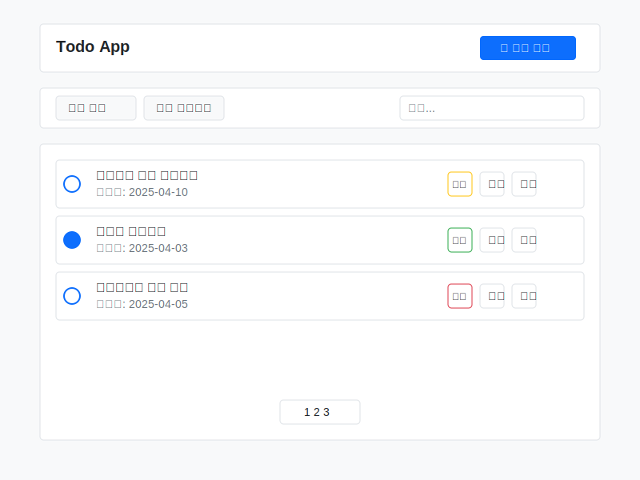
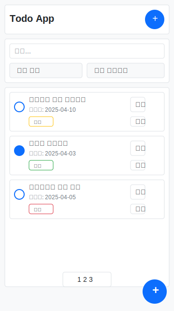

# Todo 앱 화면 디자인 설계서

## 1. 디자인 원칙

### 1.1 디자인 목표
- **단순성**: 사용자가 직관적으로 이해할 수 있는 깔끔한 인터페이스
- **접근성**: 다양한 기기와 사용자를 고려한 접근성 높은 디자인
- **일관성**: 전체 앱에서 일관된 디자인 요소 사용
- **반응형**: 모바일과 데스크톱 환경에 모두 최적화된 레이아웃

### 1.2 색상 팔레트
- **주 색상**: #0d6efd (Bootstrap 파란색)
- **보조 색상**: 
  - 낮은 우선순위: #28a745 (초록색)
  - 중간 우선순위: #ffc107 (노란색)
  - 높은 우선순위: #dc3545 (빨간색)
- **중립 색상**:
  - 배경: #f8f9fa
  - 텍스트: #212529
  - 보조 텍스트: #6c757d
  - 테두리: #dee2e6

### 1.3 타이포그래피
- **기본 폰트**: 시스템 기본 폰트 (Bootstrap 기본값)
- **제목**: 20px, 굵게
- **본문**: 14-16px
- **작은 텍스트**: 12px

## 2. 화면 구성 요소

### 2.1 헤더
- 앱 제목 표시
- 새 할일 추가 버튼 (데스크톱)
- 반응형 디자인 (모바일에서는 간소화)

### 2.2 필터 영역
- 상태별 필터 드롭다운 (전체/완료/미완료)
- 우선순위별 필터 드롭다운 (전체/낮음/중간/높음)
- 검색 입력 필드
- 반응형 디자인 (모바일에서는 세로 배치)

### 2.3 Todo 목록
- 각 Todo 항목은 카드 형태로 표시
- 완료 체크박스
- 제목 및 마감일 표시
- 우선순위 표시 태그
- 수정/삭제 버튼
- 완료된 항목은 취소선 표시

### 2.4 페이지네이션
- 항목이 많을 경우 페이지 분할
- 페이지 번호 및 이전/다음 버튼

### 2.5 모바일 전용 요소
- 하단 플로팅 액션 버튼 (새 할일 추가)
- 컴팩트한 레이아웃

## 3. 화면별 와이어프레임

### 3.1 데스크톱 레이아웃

#### 주요 특징:
- 넓은 화면을 활용한 수평 레이아웃
- 헤더에 새 할일 추가 버튼 배치
- 필터 영역을 한 줄로 배치
- 여유로운 공간 활용

### 3.2 모바일 레이아웃

#### 주요 특징:
- 세로 방향 레이아웃 최적화
- 필터 영역 세로 배치
- 하단 플로팅 액션 버튼
- 컴팩트한 Todo 항목 디자인

## 4. 상호작용 디자인

### 4.1 Todo 항목 추가
1. 사용자가 '새 할일 추가' 버튼 클릭
2. 모달 폼 표시
3. 필수 정보 입력 (제목, 우선순위 등)
4. 저장 버튼 클릭 시 목록에 새 항목 추가

### 4.2 Todo 항목 완료
1. 사용자가 체크박스 클릭
2. 체크박스 상태 변경 및 항목에 취소선 표시
3. 필터링 시 상태 반영

### 4.3 Todo 항목 수정
1. 사용자가 수정 버튼 클릭
2. 모달 폼에 기존 정보 표시
3. 정보 수정 후 저장
4. 목록에 변경사항 반영

### 4.4 Todo 항목 삭제
1. 사용자가 삭제 버튼 클릭
2. 확인 대화상자 표시
3. 확인 시 항목 삭제

### 4.5 필터링 및 검색
1. 사용자가 필터 옵션 선택 또는 검색어 입력
2. 실시간으로 목록 업데이트
3. 필터 조합 가능 (예: 완료되지 않은 높은 우선순위 항목)

## 5. 접근성 고려사항

### 5.1 키보드 접근성
- 모든 상호작용 요소는 키보드로 접근 가능
- 논리적인 탭 순서
- 포커스 표시기 제공

### 5.2 스크린 리더 지원
- 의미 있는 대체 텍스트
- ARIA 속성 적용
- 논리적인 문서 구조

### 5.3 색상 대비
- WCAG 2.1 AA 수준 준수
- 색상만으로 정보를 구분하지 않음 (아이콘, 텍스트 병행)

## 6. 반응형 디자인 브레이크포인트

- **모바일**: 0-576px
- **태블릿**: 577px-991px
- **데스크톱**: 992px 이상

각 브레이크포인트에서 레이아웃이 자연스럽게 조정되도록 설계합니다.

## 7. 구현 가이드라인

### 7.1 Bootstrap 컴포넌트 활용
- **네비게이션**: Navbar 컴포넌트
- **카드**: Card 컴포넌트
- **폼**: Form 컴포넌트
- **버튼**: Button 컴포넌트
- **모달**: Modal 컴포넌트
- **드롭다운**: Dropdown 컴포넌트

### 7.2 커스텀 CSS 가이드라인
- Bootstrap 기본 스타일을 최대한 활용
- 필요한 경우에만 커스텀 CSS 추가
- CSS 변수 활용하여 일관성 유지
- 모바일 우선 접근법 적용
